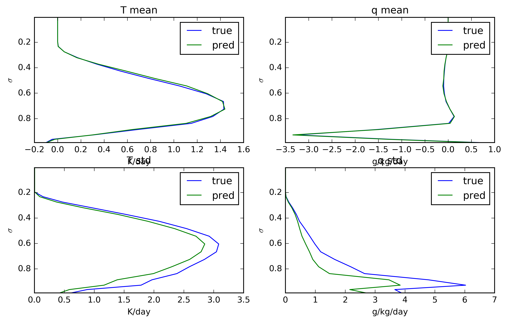

# nn-convection
Using machine learning techniques to model atmospheric convection

Train a neural network or random forest on a global climate model's physically-based convection scheme and see how well it can "learn" what the scheme does.

